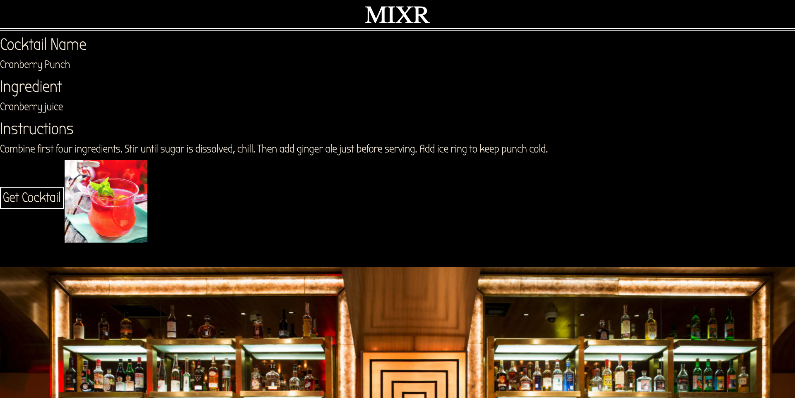
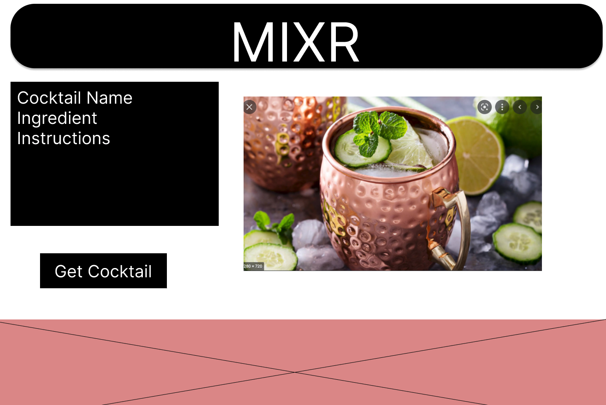

# Mixr
#### Find your new favorite cocktail.

## Description
Mixr is an app that will recommend you a cocktail at random. The app will provide the user the name of the coctail, ingredients, instructions, and a photo of the drink.

## Table of Contents
* [Technologies Used](#technologiesused)
* [Features](#features)
* [Design](#design)
* [Project Next Steps](#nextsteps)
* [Deployed App](#deployment)
* [About the Author](#author)

## Technologies Used
* JavaScript
* HTML5
* CSS3

## Features
* App pulls cocktail information from 3rd party API

## Wireframe
* 

## Trello Planning
* Link to Trello: https://trello.com/b/OFkxLvwt/project-one-web-app

## Design
* Design elements implemented using CSS

## Deployed Link
* N/A

* You can view the deployed app here:
[Click Here](https://mixr.netlify.app)

    
## Works Cited:
* https://www.w3schools.com/

## About The Author
I am a developer that builds applications that are closely tied to personal interests of mine. I use CSS, HTML, and Javascript to develop my applications.

## Future Enchancements
* Users will be able to get cocktail recommendations based on their preferences.
